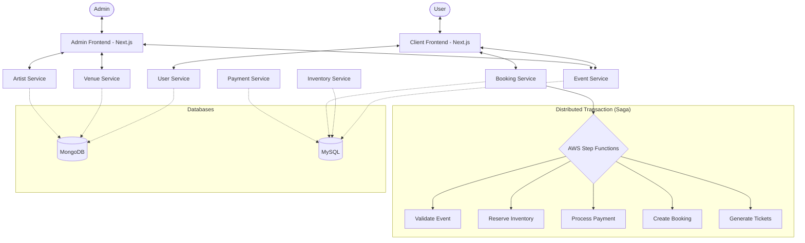

# Event Ticket Booking Application

A high-performance, scalable, microservices-based event ticket booking platform built with Node.js, Next.js, and AWS. This application leverages a distributed architecture to handle high-concurrency ticket sales with strong consistency and fault tolerance.

---

## 🏗️ Architecture Overview

The system is built using a **Microservices Architecture** with a **Saga Orchestration Pattern** to manage distributed transactions.

### System Architecture



### System Components

| Service | Responsibility | Database |
| :--- | :--- | :--- |
| **User Service** | Identity & Access Management, Profiles | MongoDB |
| **Event Service** | Event creation, management, and details | MySQL |
| **Venue Service** | Venue locations and seating configurations | MongoDB |
| **Artist Service** | Performer profiles and schedules | MongoDB |
| **Inventory Service** | Real-time ticket availability and locks | MySQL |
| **Booking Service** | Ticket reservations and issuance | MySQL |
| **Payment Service** | Transaction processing and history | MySQL |

### 🛠️ Technology Stack
- **Backend**: Node.js, Express, Prisma ORM
- **Frontend**: Next.js 15+, React 19, Tailwind CSS (v4), Shadcn UI
- **Databases**: MySQL (Transactional), MongoDB (Flexible Documents)
- **Orchestration**: AWS Step Functions (Saga Pattern)
- **Infrastructure**: Docker, Kubernetes (K8s), Terraform (IaC)
- **Communication**: REST APIs, SQS (Asynchronous tasks)

### 🔄 Distributed Transaction (Saga)
The booking process follows a Saga pattern orchestrated by **AWS Step Functions**:
1. **Validate Event**: Checks if the event exists and is active.
2. **Reserve Inventory**: Places a temporary hold on tickets.
3. **Process Payment**: Handles the financial transaction.
4. **Create Booking**: Records the confirmed booking.
5. **Generate Tickets**: Issues digital tickets with unique identifiers.
6. **Notification**: Sends confirmation to the user.

*If any step fails, the orchestrator triggers compensation actions (e.g., releasing inventory, refunding payment) to maintain system consistency.*

---

## 🚀 Getting Started

### Prerequisites
- [Docker Desktop](https://www.docker.com/products/docker-desktop/)
- [Node.js 20+](https://nodejs.org/)
- [AWS CLI](https://aws.amazon.com/cli/) (for cloud deployments)

### 1. Clone the Repository
```bash
git clone https://github.com/Chamodpw2000/event_ticket_booking_application.git
cd event_ticket_booking_application
```

### 2. Environment Configuration
Create `.env` files in each service directory and both frontend directories based on the provided `.env.example` files.

### 3. Run with Docker (Recommended)
The easiest way to start the entire backend ecosystem and databases is using Docker Compose:
```bash
docker-compose up --build
```
This will start:
- **MySQL** (Port 3307)
- **MongoDB** (Port 27017)
- **All Microservices** (Ports 3001-3007)

### 4. Start the Frontends
In separate terminals, navigate to the frontend directories and start the development servers:

**Client Frontend:**
```bash
cd client_frontend
npm install
npm run dev
```
Access at: `http://localhost:3000`

**Admin Frontend:**
```bash
cd admin_frontend
npm install
npm run dev
```
Access at: `http://localhost:3008`

---

## 🔑 Authentication (Test Users)

### Admin Dashboard
- **Admin**: `admin@tickety.com` / `1234567890`

---

## 📁 Project Structure
```text
.
├── admin_frontend/     # Next.js Admin Dashboard
├── client_frontend/    # Next.js Customer Web App
├── event_service/      # Event Management API
├── user_service/       # Identity & User API
├── booking_service/    # Ticket Reservation API
├── inventory_service/  # Real-time Stock API
├── payment_service/    # Payment Processing API
├── artist_service/     # Performer Profiles API
├── venue_service/      # Location & Venue API
├── k8s/                # Kubernetes Manifests
├── terraform/          # Infrastructure as Code
└── step_functions/     # AWS Saga Orchestration Logic
```

---

## 📡 API Ports Reference
- Event Service: `3001`
- User Service: `3002`
- Booking Service: `3003`
- Artist Service: `3004`
- Venue Service: `3005`
- Payment Service: `3006`
- Inventory Service: `3007`
